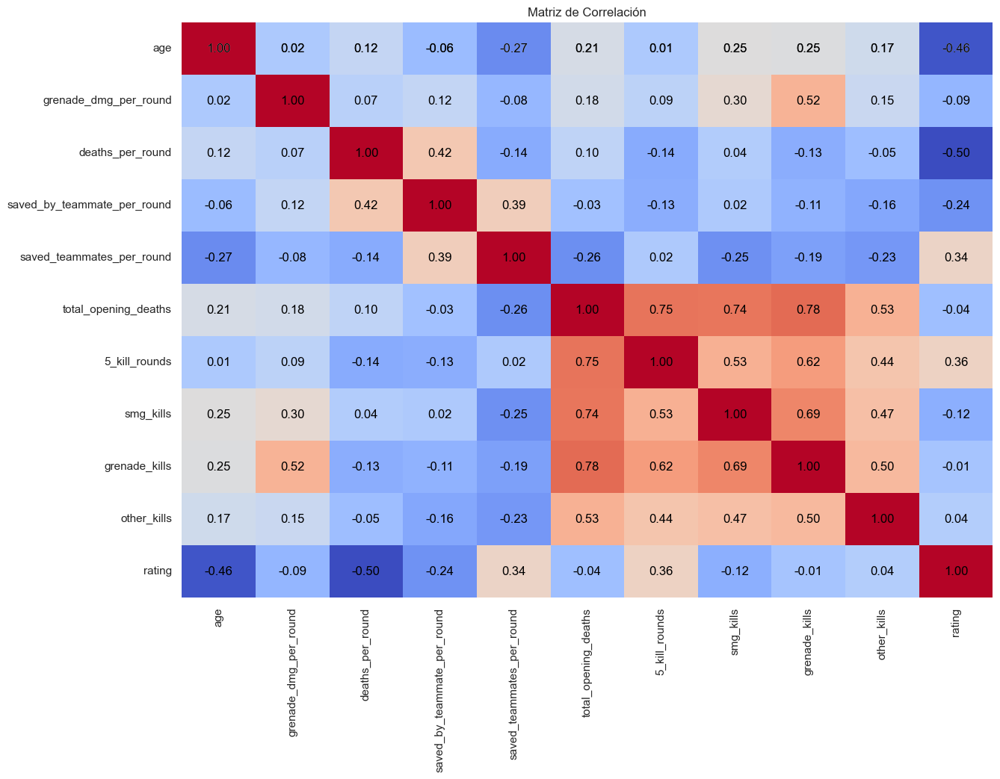
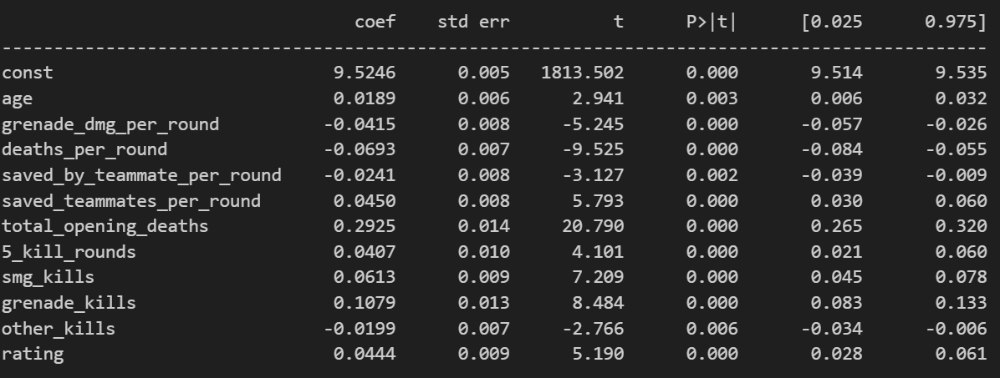

# Análisis de Estadísticas de Profesionales de Counter Strike

Este proyecto tiene como objetivo analizar las estadísticas de los profesionales de Counter Strike y desarrollar un modelo de regresión lineal para predecir las kills totales de los jugadores basándonos en diversas variables.

## Descripción del Proyecto

Counter Strike es uno de los juegos de disparos en primera persona más populares del mundo, con una escena competitiva activa y numerosos profesionales que compiten a nivel internacional. Este proyecto se enfoca en recopilar datos sobre estos jugadores y sus actuaciones en partidas profesionales.

## Contenido del Repositorio

- **Data**: Carpeta que contiene los datos utilizados en el análisis. Incluye archivos CSV con las estadísticas de los jugadores.
- **README.md**: Este archivo que proporciona información sobre el proyecto.

## Exploración de datos

Al observar el archivo CSV, podemos notar que contiene una variedad considerable de variables que serán útiles para predecir las kills. Además, es notable que no contiene valores nulos, lo que simplifica el proceso de exploración de datos.

Una vez que hemos estandarizado las variables, procedemos a crear una matriz de correlación inicial entre estas variables. Esta matriz nos ayuda a visualizar las relaciones entre las variables y su relación con nuestra variable objetivo. 

Observamos que hay numerosas variables que muestran una correlación significativa con nuestra variable objetivo. En este punto, enfrentamos una decisión crucial:

1. Conservar todas las columnas y explorar métodos que nos permitan manejar esta alta dimensionalidad.
2. Eliminar aquellas columnas que exhiben una correlación alta entre sí, simplificando así nuestro conjunto de datos. Además, debemos considerar las correlaciones entre las variables independientes (variables "x"), ya que también existen relaciones entre ellas.

Buscando en internet, descubrí un método estadístico llamado Análisis de Componentes Principales (PCA), el cual prometía eliminar correlaciones sin necesidad de eliminar columnas, lo cual parecía ideal para mi modelo. Sin embargo, como suele suceder, las soluciones no siempre son tan simples como parecen, y el modelo seguía sobreajustado. Fue entonces cuando decidí desarrollar una función que, si superaba un umbral de correlación, eliminaría una de las columnas. Intenté implementar este método utilizando tanto el valor de la matriz de correlación como el Factor de Inflación de la Varianza (VIF).

Después de realizar algunos ajustes, desarrollé un modelo de regresión lineal eliminando algunas columnas. Este modelo alcanzó un valor de R^2 de 0.921, utilizando 10 variables, todas ellas con un valor p de menos de 0.02. Este resultado indica un buen ajuste del modelo a los datos. Estoy satisfecho con este logro y confiado en la capacidad del modelo para predecir las kills totales con precisión.

| Variable                     | VIF      |
|------------------------------|----------|
| const                        | 1.000000 |
| age                          | 1.494668 |
| grenade_dmg_per_round        | 2.134244 |
| deaths_per_round             | 1.921602 |
| saved_by_teammate_per_round  | 1.873278 |
| saved_teammates_per_round    | 1.880399 |
| total_opening_deaths         | 7.077094 |
| 5_kill_rounds                | 3.715690 |
| smg_kills                    | 2.607163 |
| grenade_kills                | 6.099491 |
| other_kills                  | 1.498728 |
| rating                       | 2.492132 |

# OLS Regression Results

|                         |                            |
|-------------------------|----------------------------|
| *Dep. Variable:*      | total_kills                |
| *Model:*              | OLS                        |
| *Method:*             | Least Squares              |
| *Date:*               | Thu, 16 May 2024           |
| *Time:*               | 20:56:59                   |
| *No. Observations:*   | 648                        |
| *Df Residuals:*       | 636                        |
| *Df Model:*           | 11                         |
| *Covariance Type:*    | nonrobust                  |

|                         |                            |
|-------------------------|----------------------------|
| *R-squared:*          | 0.921                      |
| *Adj. R-squared:*     | 0.920                      |
| *F-statistic:*        | 678.5                      |
| *Prob (F-statistic):* | 0.00                       |
| *Log-Likelihood:*     | 391.69                     |
| *AIC:*                | -759.4                     |
| *BIC:*                | -705.7                     |

Espero que este proyecto haya sido de su agrado y les agradezco por tomar el tiempo de leer este documento.

¡Gracias!
